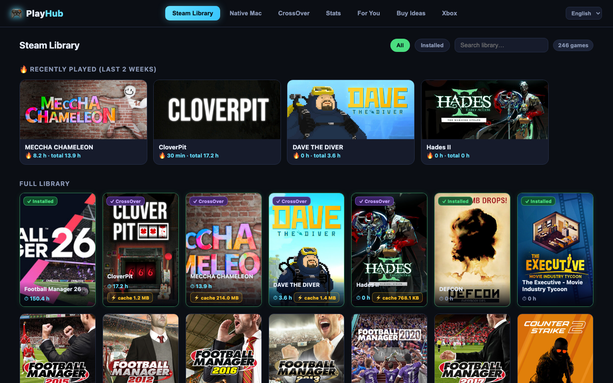

# 🎮 PlayHub

**A local game hub for Mac gamers.** Your Steam library, native Mac games,
CrossOver bottles with D3DMetal shader-cache backup, playtime stats,
personal recommendations and cross-store price comparison — in one fast,
dark-themed dashboard that runs entirely on your Mac.

> No account. No telemetry. Your Steam API key stays in a local file and is
> only ever sent to Valve's own API.



## Features

- **Steam Library** — every game you own with cover art and playtime.
  Installed games sort first with clear badges (native Mac vs CrossOver),
  search, filters, and a hover ▶ button that launches games — natively via
  Steam, or inside the right CrossOver bottle via `steam.exe -applaunch`.
- **CrossOver tools** *(the feature nothing else has)* — detects your
  bottles and their **D3DMetal shader caches** (the ones that take forever to
  compile on first launch), shows exactly where they live, and lets you
  **back up / restore** them with one click. An auto-backup watcher snapshots
  caches after games finish compiling, so a macOS cache cleanup never costs
  you a re-compile again. Plus a safe bottle temp cleaner.
- **Achievements** — click any game: unlock progress, Steam review level,
  Metacritic score and HowLongToBeat times with your own progress vs "Main".
- **Stats** — total playtime, top-10 chart, and (if you're a Football
  Manager person) the whole series year by year.
- **For You** — a recommendation engine over the games you *already own but
  never played*: your genre profile (weighted by playtime) × Steam review
  quality × Metacritic.
- **Buy Ideas** — popular, well-reviewed games you *don't* own, matched to
  your taste, with live prices across Steam / Humble / Fanatical / GMG / GOG
  via IsThereAnyDeal.
- **Menu bar app** — your top games one click away, launches via PlayHub.
- **Claude Desktop MCP server** *(optional)* — exposes your library,
  recent games and achievements as tools for Claude.
- **English & Danish** UI — more languages are one dictionary file away.

## Requirements

- macOS (Apple Silicon recommended; CrossOver features need
  [CrossOver](https://www.codeweavers.com/crossover) with D3DMetal)
- [Node.js](https://nodejs.org) 18+ (`brew install node`)
- A free [Steam Web API key](https://steamcommunity.com/dev/apikey)
- Xcode Command Line Tools (optional — only for the menu bar app)

## Install

```bash
git clone https://github.com/PLACEHOLDER/playhub.git
cd playhub
./install.sh
```

Then open **http://127.0.0.1:4173** (or double-click **PlayHub** on your
Desktop). A first-run wizard asks for your Steam API key and SteamID —
with validation, so you know it works before you save.

The server runs as a launchd agent (starts at login, restarts on crash).

### Uninstall

```bash
./uninstall.sh          # keeps your .env and shader-cache backups
./uninstall.sh --purge  # removes everything
```

## Privacy

Everything runs locally on `127.0.0.1`. PlayHub makes outbound requests to:

| Service | Purpose | When |
|---|---|---|
| `api.steampowered.com` | Your library, playtime, achievements | Always (your own API key) |
| Steam CDN / store API | Cover art, review levels, Metacritic, genres | Background enrichment |
| `steamspy.com` | Popularity lists for Buy Ideas | Buy Ideas tab |
| `api.isthereanydeal.com` | Cross-store prices | Only if you add a free ITAD key |
| `howlongtobeat.com` | Completion times | Game detail view (unofficial API, fails gracefully) |

No data leaves your machine otherwise. No analytics, no accounts.

## The D3DMetal shader-cache story

CrossOver's D3DMetal translates DirectX shaders to Metal and caches the
result under `$(getconf DARWIN_USER_CACHE_DIR)/d3dm/<Game>.exe/`. First
launches of big DX12 titles can compile for many minutes — and macOS can
wipe that cache folder whenever it wants. PlayHub maps each cache to the
right game and bottle, backs it up (manually or automatically), and restores
it byte-for-byte. Warm caches, forever.

## Development

```
mcp-server/   MCP server for Claude Desktop (stdio)
web/          Express server + vanilla-JS frontend
menubar/      Swift menu bar app
scripts/      setup.sh (generates per-user artifacts), register-mcp.mjs
```

`scripts/setup.sh --services|--menubar|--desktop|--mcp` regenerates any
individual artifact. UI strings are English-canonical with translations in
`web/public/i18n.js` — adding a language is one dictionary object.

## License

[MIT](LICENSE)
